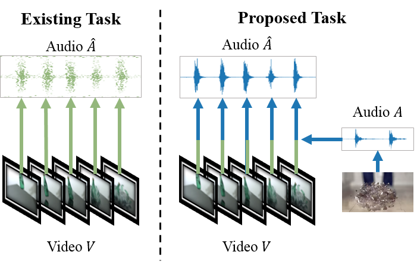

# VarietySound
----

## VarietySound : Timbre Controllable and Temporal Aligned Video-to-Sound Generation

### Timbre Controllable Video to Sound Generation

The current video-to-sound generation works share a common problem: all of their acoustic information comes from the model’s prediction and cannot control the timbre of the generated audio. To match this problem, we defined a task called Timbre Controllable Video to Sound Generation (TCVSG), whose target is to allow users to generate realistic sound effects with their desired timbre for silent videos.



we have a video clip V of an object breaking for movie production, but the natural recorded sounds are not impressive enough. So with this task, we can use an additional audio **A** with a more remarkable sound of breaking to generate an audio track for **V** . The generated audio **Aˆ** will be time-aligned with **V** , but has the same kind of sound as A which will make the video more exciting. As far as we know, we are the first to propose this task.

### Generated Results
<table>
    <thead>
        <th>Category</th>
        <th>Original Video</th>
        <th>Reference Audio</th>        
        <th>Video with Generated Audio</th>
    </thead>
    <tbody>
        <tr>
            <th>Baby</th>
            <td><video width="100%" height="240" controls><source src="demo/videos/baby.mp4" type="video/mp4"></video></td>  
            <td><audio controls style="width: 150px;"><source src="demo/audios/baby.wav" type="audio/wav"></audio></td>                      
            <td><video width="100%" height="240" controls><source src="demo/videos/baby_gen.mp4" type="video/mp4"></video></td>
        </tr>
    </tbody>
    <tbody>
      <tr>
          <th>Cough</th>
            <td><video width="100%" height="240" controls><source src="demo/videos/cough.mp4" type="video/mp4"></video></td>  
            <td><audio controls style="width: 150px;"><source src="demo/audios/cough.wav" type="audio/wav"></audio></td>                      
            <td><video width="100%" height="240" controls><source src="demo/videos/cough_gen.mp4" type="video/mp4"></video></td>
      </tr>
    </tbody>
    <tbody>
      <tr>
          <th>Dog</th>
            <td><video width="100%" height="240" controls><source src="demo/videos/dog.mp4" type="video/mp4"></video></td>  
            <td><audio controls style="width: 150px;"><source src="demo/audios/dog.wav" type="audio/wav"></audio></td>                      
            <td><video width="100%" height="240" controls><source src="demo/videos/dog_gen.mp4" type="video/mp4"></video></td>
      </tr>
    </tbody>
    <tbody>
      <tr>
          <th>Drum</th>
            <td><video width="100%" height="240" controls><source src="demo/videos/drum.mp4" type="video/mp4"></video></td>  
            <td><audio controls style="width: 150px;"><source src="demo/audios/drum.wav" type="audio/wav"></audio></td>                      
            <td><video width="100%" height="240" controls><source src="demo/videos/drum_gen.mp4" type="video/mp4"></video></td>
      </tr>
    </tbody>
    <tbody>
      <tr>
          <th>Fireworks</th>
            <td><video width="100%" height="240" controls><source src="demo/videos/fireworks.mp4" type="video/mp4"></video></td>  
            <td><audio controls style="width: 150px;"><source src="demo/audios/fireworks.wav" type="audio/wav"></audio></td>                      
            <td><video width="100%" height="240" controls><source src="demo/videos/fireworks_gen.mp4" type="video/mp4"></video></td>
      </tr>
    </tbody>
    <tbody>
      <tr>
          <th>Gun</th>
            <td><video width="100%" height="240" controls><source src="demo/videos/gun.mp4" type="video/mp4"></video></td>  
            <td><audio controls style="width: 150px;"><source src="demo/audios/gun.wav" type="audio/wav"></audio></td>                      
            <td><video width="100%" height="240" controls><source src="demo/videos/gun_gen.mp4" type="video/mp4"></video></td>
      </tr>
    </tbody>
    <tbody>
      <tr>
          <th>Hammer</th>
            <td><video width="100%" height="240" controls><source src="demo/videos/hammer.mp4" type="video/mp4"></video></td>  
            <td><audio controls style="width: 150px;"><source src="demo/audios/hammer.wav" type="audio/wav"></audio></td>                      
            <td><video width="100%" height="240" controls><source src="demo/videos/hammer_gen.mp4" type="video/mp4"></video></td>
      </tr>
    </tbody>
    <tbody>
      <tr>
          <th>Sneeze</th>
            <td><video width="100%" height="240" controls><source src="demo/videos/sneeze.mp4" type="video/mp4"></video></td>  
            <td><audio controls style="width: 150px;"><source src="demo/audios/sneeze.wav" type="audio/wav"></audio></td>                      
            <td><video width="100%" height="240" controls><source src="demo/videos/sneeze_gen.mp4" type="video/mp4"></video></td>
      </tr>
    </tbody>
</table>

----

<!-- ## Welcome to GitHub Pages

You can use the [editor on GitHub](https://github.com/VarietySound/Anonymous1398/edit/main/README.md) to maintain and preview the content for your website in Markdown files.

Whenever you commit to this repository, GitHub Pages will run [Jekyll](https://jekyllrb.com/) to rebuild the pages in your site, from the content in your Markdown files.

### Markdown

Markdown is a lightweight and easy-to-use syntax for styling your writing. It includes conventions for

```markdown
Syntax highlighted code block

# Header 1
## Header 2
### Header 3

- Bulleted
- List

1. Numbered
2. List

**Bold** and _Italic_ and `Code` text

[Link](url) and 
```

For more details see [Basic writing and formatting syntax](https://docs.github.com/en/github/writing-on-github/getting-started-with-writing-and-formatting-on-github/basic-writing-and-formatting-syntax).

### Jekyll Themes

Your Pages site will use the layout and styles from the Jekyll theme you have selected in your [repository settings](https://github.com/VarietySound/Anonymous1398/settings/pages). The name of this theme is saved in the Jekyll `_config.yml` configuration file.

### Support or Contact

Having trouble with Pages? Check out our [documentation](https://docs.github.com/categories/github-pages-basics/) or [contact support](https://support.github.com/contact) and we’ll help you sort it out.
 -->
